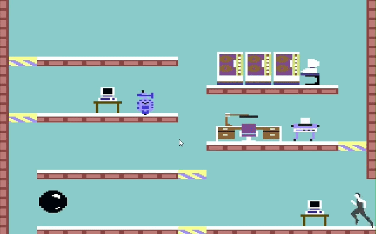
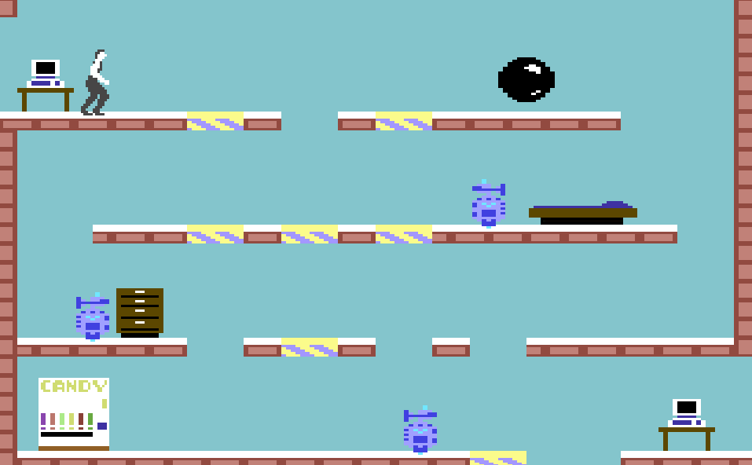
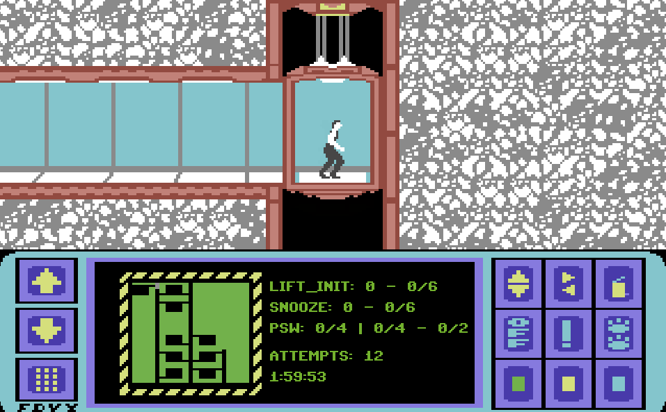
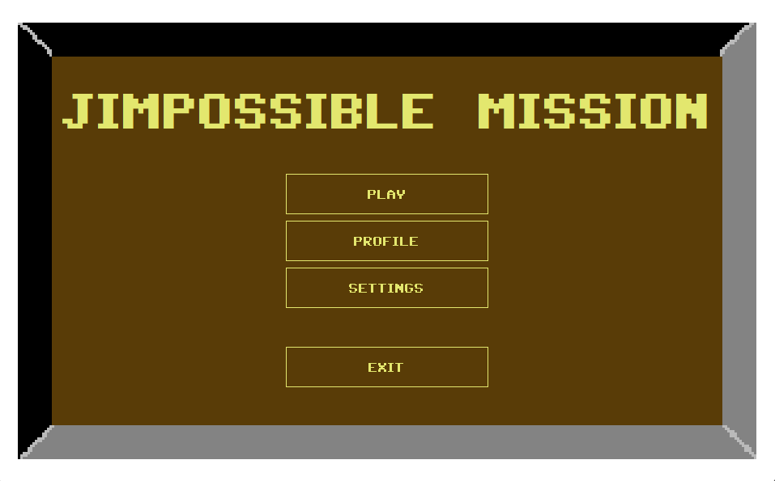

# -JImpossibleMission-

*(Versione italiana sotto)*
# ENGLISH
Repository of the project for Programming Methodologies (Sapienza University of Rome) **JImpossibleMission** assigned in the academic year 2024-2025.

**JImpossibleMission** is a light recreation in Java of the original Commodore 64 2D platform game **Impossible Mission** by Dennis Caswell.
The game features a secret agent (controlled by the player) exploring the underground fortress of a criminal mastermind with the goal of collecting the complete password and gaining access to his control room where the criminal is hiding, all while avoiding his robot guards and within a time limit.

The project aims to apply the knowledge learned in classes, such as the principles of OOP (Encapsulation, Inheritance, Polymorphism, and Abstraction), Streams, and Design Patterns.

# Repository Contents
- JImpossibleMission/
  - src -> All the Java classes
  - resources -> Data, sprites and audio
  - data -> Profiles and leaderboard
  - javadoc -> Generated documentation
- Project UML.
- Project report.

# Game Specifications
- 8 profiles, with customizable nicknames and avatars (8 available images), which save the number of games played (with wins/losses) and accumulated scores (used for the level progression).
- A leaderboard that saves up to 15 records, which consist of an ID (the first 5 characters in caps of the currently used profile name) and the score accumulated in the game.
- A settings window where you can reset the leaderboard and disable the menu music and general audio.
- 9 rooms with different tile layouts and enemies (one of which is the room containing the entrance to the control room).
- 2 enemy types: Ball and Robot (the latter has 4 randomly selected behaviors with a 1/5 chance of having an electric attack).
- 22 types of furniture (not all have been used) that can be interacted with, along with the terminals and the entrance to the control room.
- 8 pass pieces (to form 2 passes), plus special action passes (6 to temporarily disable enemies and 6 to reset the lift platforms to their original positions).
- 2 hours limit time of the game (reduces by 10 minutes each time the player dies).
- Debug mode.

# Applied Design Patterns
- **MVC (Model-View-Controller)**: The main pattern of this project, which divides the classes into three main roles. *Model* for managing the logic, *View* for managing the output (animation, interfaces, and audio), and *Controller* for coordinating the *Model* with the *View*.
- **Observable/Observer**: This pattern is primarily used by *Observables*, which send the notification, and *Observers*, which receive the notification and, depending on its type, perform the requested action.
- **Strategy**: Used for interchangeable algorithms such as the KeyListener (between the Play and Result states) and the behaviors of the Robot enemy.
- **Simple Factory**: Simple classes with static methods used for creating objects (such as Swing components and game entities).
- **Singleton**: Creates a single and centralized instance of a class, like the classes that manage the sprites and the audio.

# Keyboard Input
**During the Game**
- 'W' / '↑': Move the elevator up / Move the lift platform up (only if the player is completely on top of it) / Interact with nearby object.
- 'A' / '←': Move left.
- 'S' / '↓': Move the elevator down / Move the lift platform down (only if the player is completely on top of it).
- 'D' / '→': Move right.
- 'SPACE': Jump.
- 'ESC': Quit the game and return to the main menu.
- 'R': Restart a new game (the previous game will still be saved as lost).
- '\\': Show debug elements.

**During the Result Screen**
- 'ESC': Return to the main menu.
- 'R': Restart a new game.

# How to run
**Requirements**
- Java 17
- Eclipse (used for this project) or any Java IDE

**Steps (Eclipse)**
- Clone the [repository](https://github.com/LeoGG02/JImpossibleMission.git) or download the repository as file '.zip' and extract.
- Import the project into your IDE.
- Go to the 'JImpossibleMission' class in 'controller' package and run the program.

**In case of 'java.lang.UnsupportedClassVersionError' (only Eclipse solution)**
- Right click on the 'JImpossibleMission' project
- Properties
- Java Compiler
- ✓ Enable project specific settings
- ✓ Use compliance from execution enviroment 'JavaSE-17' on 'Java Build Path'
- Apply and Close

In case you're usig other IDE, you just have to set the project/compiler to Java 17.

**Steps (Terminal)**
- Download the repository as file '.zip' and extract.
- Open the Terminal.
- Set the directory of 'JImpossibleMission' with inside the 'src' folder (example cd 'C:/User/user/Download/JImpossibleMission').
- Compile by executing 'javac -d out -cp "resources" --source-path src src/controller/JImpossibleMission.java'.
- Run 'java -cp "out;resources" controller.JImpossibleMission'.

---
# ITALIANO
Repository del progetto di Metodologie di Programmazione (Sapienza Roma) **JImpossibleMission** assegnato nell'anno 2024-2025.

**JImpossibleMission** è una lieve ricreazione in Java del gioco originale platform a 2D del Commodore 64 **Impossible Mission** di Dennis Caswell.
Il gioco segue un agente segreto (controllato dal giocatore) che esplora la fortezza sotterranea di un genio criminale con lo scopo di ricavare la password completa e avere accesso alla sua stanza di controllo dove il criminale si nasconde, il tutto evitando i suoi robot di guardia ed entro un tempo limite.

Il progetto ha lo scopo didattico di applicare le conoscenze imparate alle lezioni come il principio di OOP (Incapsulamento, Ereditarietà, Polimorfismo e Astrazione), i Stream e i Design Pattern.

# Contenuti della repository
- JImpossibleMission/
  - src -> Tutte le classi Java
  - resources -> Dati, sprite e audio
  - data -> Profili e classifica
  - javadoc -> Documentazione generata
- UML del progetto.
- Relazione del progetto.

# Specifiche del gioco
- 8 profili, con nickname e avatar (disponibili 8 immagini) personalizzabili e che salva la quantità di partite fatte (con vittorie/perse) e punteggi accumulati (utilizzate per il livello di progresso).
- Una classifica che salva fino a 15 record composto da un ID (I primi 5 caratteri in maiuscolo del nome del profilo utilizzato nel momento) e il punteggio accumulato nella partita.
- Una finestra di impostazione da cui è possibile resettare la classifica e disattivare la musica del menu e l'audio generale.
- 9 stanze con layout di tasselli e nemici diversi (di cui una è la stanza dove è presente l'entrata per la stanza di controllo).
- 2 tipi di nemici: Ball e Robot (con quest'ultima ha 4 comportamenti scelti casualmente con la possibilità 1/5 di avere l'attacco elettrico).
- 22 tipi di mobili (non tutti sono stati utilizzati) interattivi insieme ai terminali e l'entrata della stanza di controllo.
- 8 pezzi del pass (da formare 2 pass) insieme pass per le azioni speciali (6 per disabilitare i nemici temporaneamente e 6 per resettare le piattaforme lift nella loro posizione originale).
- 2 ore di tempo limite a partita (ogni morte si riduce di 10 minuti).
- Modalità debug.

# Design Pattern applicati
- **MVC (Model-View-Controller)**: Il pattern principale di questo progetto che suddivide le classi in 3 compiti principali. *Model* per la gestione della logica, *View* per la gestione output (animazione, interfacce e audio) e *Controller* per cordinare il *Model* con la *View*.
- **Observable/Observer**: Pattern che fa di utilizzo principale gli *Observable*, colui che manda la notifica, e gli *Observer*, coloro che ricevono la notifica e, a seconda del suo tipo, fanno l'azione richiesto.
- **Strategy**: Utilizzato per algoritmi intercambiabili come il KeyListener (tra lo stato Play e Result) e i comportamenti del nemico Robot.
- **Simple Factory**: Semplici classi con metodi statici utilizzati per creazioni di oggetti (come componenti Swing e entità del gioco).
- **Singleton**: Rende l'istanza di una classe unica e centralizzata, come le classi che gestisce i sprite e audio.

# Input da Tastiera
**Durante la partita**
- 'W' / '↑' : Muove l'ascensore verso sù / Muove la piattaforma lift verso sù (solo se il giocatore è completamente sopra ad esso) / Interagisce con l'oggetto vicino.
- 'A' / '←' : Muove verso sinistra.
- 'S' / '↓' : Muove l'ascensore verso giù / Muove la piattaforma lift verso giù (solo se il giocatore è completamente sopra ad esso).
- 'D' / '→' : Muove verso destra.
- 'SPACE' : Salta.
- 'ESC' : Lascia la partita e ritorna nel menu principale.
- 'R' : Ricomincia in una nuova partita (la partita precedente verrà comunque salvata come persa).
- '\\' : Mostra elementi di debug.

**Durante la schermata del risultato**
- 'ESC': Ritorna nel menu principale.
- 'R': Ricomincia in una nuova partita.

# Come avviare il gioco
**Requisiti**
- Java 17
- Eclipse (utilizzata per questo progetto) o un qualsiasi Java IDE (opzionali).

**Step (Eclipse)**
- Clona il [repository](https://github.com/LeoGG02/JImpossibleMission.git) o scarica il repository in formato '.zip' ed estrailo.
- Importa il progetto nel tuo IDE.
- Vai sulla classe 'JImpossibleMission' nel package 'controller' e avvia il programma.

**In caso di 'java.lang.UnsupportedClassVersionError' (soluzione solo per Eclipse)**
- Tasto destro al progetto 'JImpossibleMission'.
- 'Properties'.
- 'Java Compiler'.
- ✓ 'Enable project specific settings'.
- ✓ 'Use compliance from execution enviroment 'JavaSE-17' on 'Java Build Path''.
- 'Apply and Close'.

In caso se non utilizzassi altri IDE, devi solo impostare il progetto/compilatore a Java 17.

**Step (Terminale)**
- Scarica il repository come file '.zip' ed estrailo.
- Apri il Terminale.
- Imposta la directory di 'JImpossibleMission' con all'interno la cartella 'src' (esempio: 'cd C:/User/user/Download/JImpossibleMission').
- Compila eseguendo 'javac -d out -cp "resources" --source-path src src/controller/JImpossibleMission.java'.
- Esegui 'java -cp "out;resources" controller.JImpossibleMission'.
